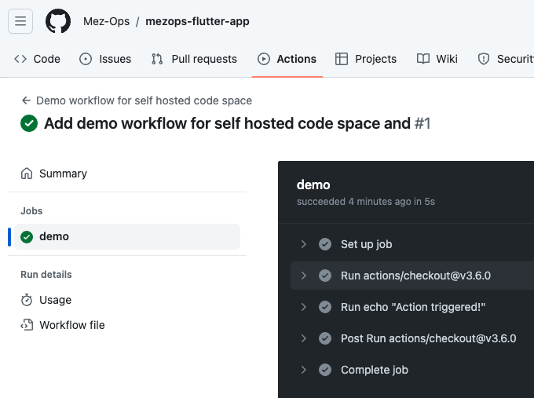
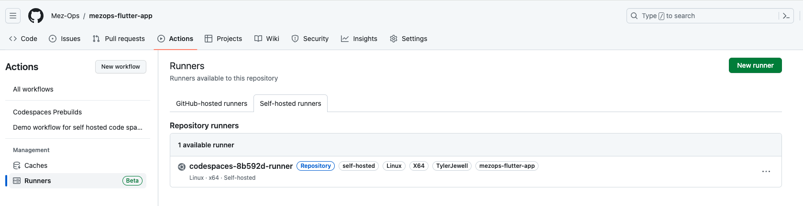

# Mez Ops Flutter App Template

This is meant to be a simple code space where Flutter has been setup and configured. 

Below are some instructions on creating your first Flutter app.

I will be using flutter web apps primarily, but you can use this template for mobile apps as well.

# Getting Started

This will walk you through setting up your first Flutter app.

## Understanding how this template works.

First, watch this video:

https://dev.to/pwd9000/run-self-hosted-github-runners-on-github-codespaces-video-tutorial-1ggh

or go through this tutorial:

https://dev.to/pwd9000/hosting-your-self-hosted-runners-on-github-codespaces-2elc

Note: you will need to follow along with this repo. There will be some steps where you need
to create 3 secrets in the repo using a GitHub personal access token. 

## Initial setup

### Ensure the github actions are running properly.

By default, there will be a self-hosted github actions ci machine setup
that will run all actions against the exact machine you are using to
develop on. This will eliminate any issues with the CI machine not
having the same environment as your local machine.

First, go into .github/workflows and open the demo_action_self_hosted.yml file.
Replace the `runs-on` field with an array that includes your GH_OWNER variable
that you set in the secrets section of the code-space for the repo.

Once done, commit the changes and push them to the repo. This should
start the github actions workflow. 

You can also look at this runner here:

## Firebase setup

In order to push your app to hosting, you will need to
setup a firebase app first. We will do this in the console
below. You should have at least set up a Firebase account here:

https://console.firebase.google.com/

Once you have an account, you can create a new project.

## Setup 

## Contact

Template created, paid for, and maintained by [Mez Ops].

Contact: hello@mezops.com