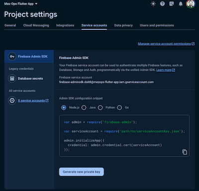

# A Mez Ops Flutter App

This is intended to be a template for a flutter app that is ready to go with firebase and the firebase emulator suite.

This is a public template and anyone it welcome to use. 

If you think this is worthy of a donation, please send money to:

`https://account.venmo.com/u/Tyler-jewell1`

## Getting Started

### Prerequisites

#### Firebase project

1. Create a firebase project
    - https://console.firebase.google.com/
2. Enable hosting in console
    - In console, click on 'Hosting' in the left nav and then click 'Get Started'
3. Download the credentials.json file
    - After creating the project, click the gear icon next to the project name -> Project Settings -> Service Accounts -> Generate new private key

    
4. Copy the json file to the root of the project

**Note: make sure it is not checked into version control!!!**

### Building and deploying your app

It's as simple as running the following command:

```bash
flutter build web && firebase deploy --only hosting
```

Assuming you have followed the steps above, your app should be built and deployed to firebase hosting.

### Developing locally with firebase emulators

To run an app and connect it to the firebase emulators, run the following command:

```bash
firebase emulators:exec "flutter run -d chrome --web-port 5001 --web-hostname localhost"
```

## Included in base image

The docker image used for the container can be found here:

`https://hub.docker.com/r/tylerpjewell/mezops-flutter-firebase-image/tags`

or, you can pull locally:

```bash 
docker pull tylerpjewell/mezops-flutter-firebase-image:latest
```

You will not need to do any of the steps above, just for reference. 

### Flutter

Image comes preinstalled with the latest version of flutter. 

### Firebase (CLI)

Image comes preinstalled with the latest version of firebase.

#### Firebase CLI auth

Make sure you followed instructions in the prerequisites section above for the firebase cli to authenticate with your project.


## Chat GPT reference:
`/.devcontainer/devcontainer.json`: 
    - https://containers.dev/implementors/json_reference/
`/.devcontainer/Dockerfile`:
    - https://github.com/nodejs/docker-node (the base image docs)
    - https://docs.docker.com/engine/reference/builder/ (Dockerfile reference docs) 
    - https://firebase.google.com/docs/cli/#install-cli-mac-linux (installing firebase cli on linux)
    - https://firebase.google.com/docs/flutter/setup?platform=web (firebase setup for flutter web)
    - https://firebase.google.com/docs/flutter/setup?platform=android (firebase setup for flutter android)
    - https://firebase.google.com/docs/flutter/setup?platform=ios (firebase setup for flutter ios)
    - https://firebase.google.com/docs/projects/dev-workflows/overview-environments (firebase environments)
    - https://firebase.google.com/docs/cli/#initialize_a_firebase_project (best practices for firebase)
    - https://firebase.google.com/docs/emulator-suite (firebase emulator suite)
    - https://firebase.google.com/docs/emulator-suite/connect_and_prototype (firebase emulator suite connect and prototype)
    - https://firebase.google.com/docs/emulator-suite/connect_firestore (firebase emulator suite connect firestore)
    - https://firebase.google.com/docs/emulator-suite/install_and_configure (firebase emulator suite install and configure)
`firebase.json`:
    - https://firebase.google.com/docs/cli/#the_firebasejson_file
