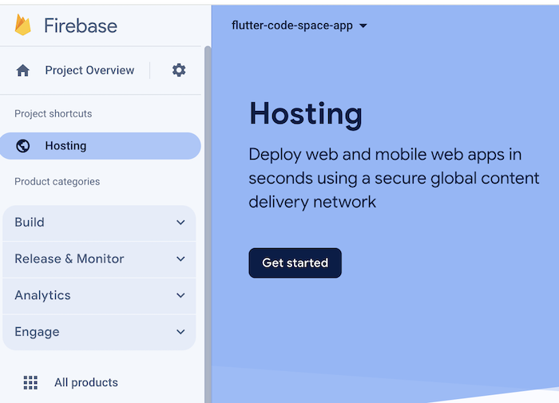
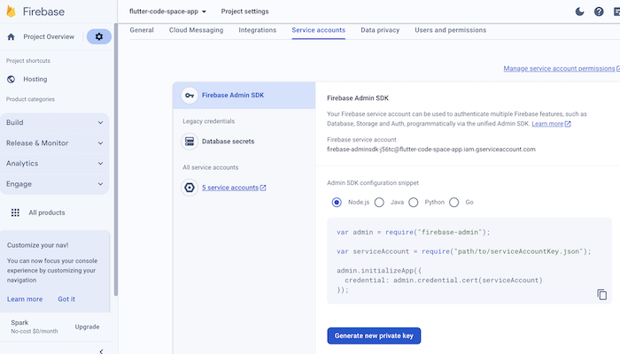
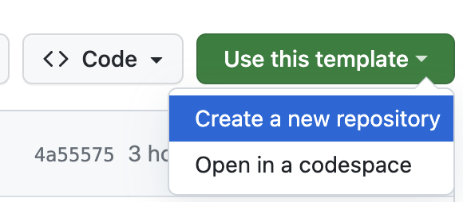
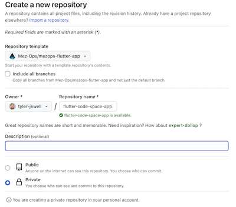
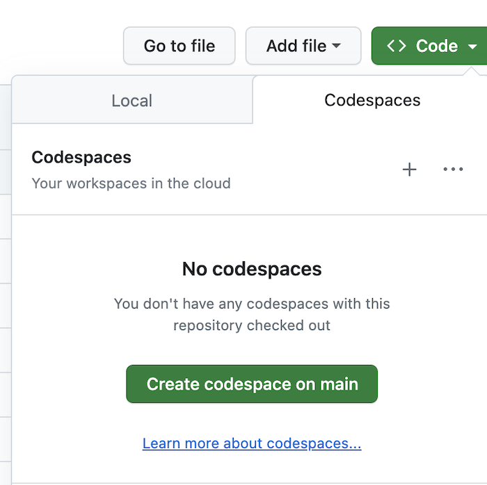
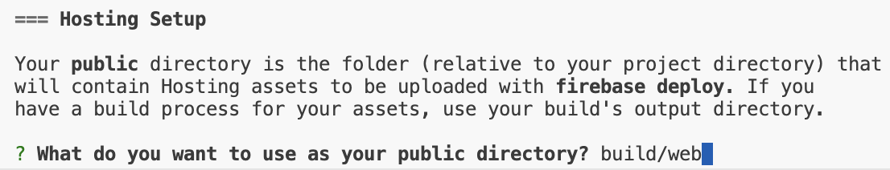
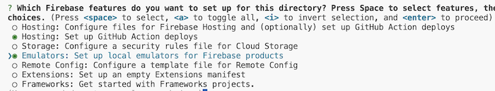
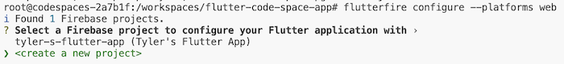
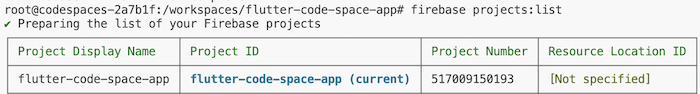

# Mez Ops Flutter Code Space App

This is a template repository that comes pre-configured with
a code space environment that is setup for developing Flutter web
apps.

TODO: Add more platform support for Flutter. 

## Getting Started

# Setup Firebase project

Go to the Firebase console: https://console.firebase.google.com/

And create a new firebase project. 

Once complete, initialize Firebase Hosting in the console.

<p align="center">
  
</p>

Just use the default settings for everything. Do not worry about the instructions, just click continue.

Next, we need to get the Google service account credentials which will be used by GitHub actions to deploy your app automatically. 

Navigate to Project Settings -> Service Accounts and then download the key to your local machine.

<p align="center">
  
</p>

Once downloaded, copy the json and go over to the template repository in GitHub: https://github.com/Mez-Ops/mezops-flutter-app

From here, we want to use the template to create your own repo. To do this, click on the "Use this template" button.

<p align="center">
  
</p>

<p align="center">
  
</p>

Once you have created a repo in your personal account, navigate to Settings -> Secrets and Variables -> Actions -> Secrets and create a new secret called `GOOGLE_APPLICATION_CREDENTIALS`. This will be used by GitHub actions to authenticate you with Firebase and deploy apps. 

Now, we can create the code space. This will open up a linux environment in the browser that comes pre-configured with Flutter, Firebase CLI, and GitHub CLI.

Go to your repo and select Code -> Codespaces

<p align="center">
  
</p>

Once open, authenticate with Firebase CLI:

```bash
firebase login
```

Follow the instructions and put the key from the browser into the terminal.

Next, ensure you are properly authed with the GitHub CLI by running:

```bash
gh repo list
```

### Initialize Firebase

Docs:
- https://firebase.google.com/docs/cli#install-cli-mac-linux
- https://firebase.google.com/docs/flutter/setup?platform=web

Now, we can initialize Firebase and link it with the Flutter app.

First, initialize Firebase with the CLI:

```bash
firebase init
```

Change the build directory to `build/web`:

<p align="center">
  
</p>

Choose the hosting emulator:

<p align="center">
  
</p>

Next, add some dependencies to the Flutter app:

```bash
dart pub global activate flutterfire_cli
 && flutter pub add firebase_core
```

Finally, configure the flutter app with Firebase:

```bash
flutterfire configure --platforms web
```

Select the app that you created in the earlier steps.

<p align="center">
  
</p>

Ensure that the .firebaserc file was updated with your project:

```json
{
  "projects": {
    "default": "flutter-code-space-app"
  }
}
```

Ensure you are currently on the Firebase project that you created:

```bash
firebase projects:list
```

<p align="center">
  
</p>

### Build and deploy your first app!

Ok, now everything is basically ready to go for a automated CI/CD pipeline with Flutter and Firebase. 

First, we need to build the app:

```bash
flutter build web
```

This will put the build in the build/web folder.

Then, we can deploy to firebase with:

```bash
firebase deploy --only hosting
```

This should take a few minutes and upload a new build of your web app!

### GitHub actions integrations.

Now that we have built and deployed an app locally, we can now set up github actions so that the app is automatically built and deployed whenever a new change is pushed to the repo.

Go into the `.github/workflows/deploy_to_firebase.yml` and update the `insert-trigger-branch-here` with `main`. This will tell GitHub actions to run this action every time there is a push to the main branch. 

Commit and push all files from the codespace and then naviagte to the repo and then click the Actions tab. You should see your action running. Click on this to monitor the progress.

When this is complete, hop over to https://console.firebase.com and see if the app was deployed.

### Local development

There are a couple ways to develop locally.

#### Firebase emulator

This will use the Firebase emulator to run the app locally. We won't use this for now.

#### Flutter web server

The easiest way is to just run the flutter app locally using a web-server as the device. 

```bash
flutter run -d web-server
```

Once this is finished, you can select the Port tab on the terminal. Find the port that the app is running on and you can either select the browser or preview. 

When you make changes to the app, you will need to Hot Reload and then refresh the browser to see changes. 


